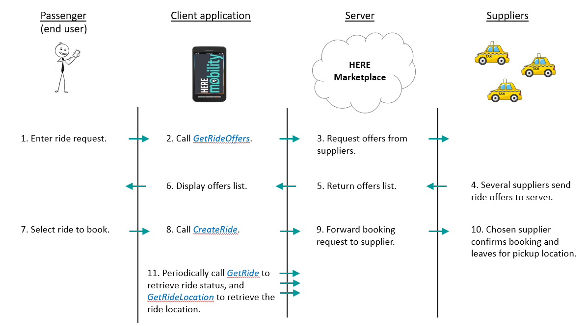

# HERE Mobility Platform Overview # 

HERE Mobility aims to democratize the mobility ecosystem. We are creating a competitive marketplace powered by intelligent technological solutions for all mobility service providers, businesses, and consumers.

HERE's central platform is the **HERE Mobility Marketplace**, a hub for supplying and requesting mobility services, for businesses and consumers. The Marketplace enables matching up end users with suppliers who can meet their needs for transportation and delivery.

The **HERE Mobility Demand API** is a REST or GRPC API that enables the customer application to request, book and cancel mobility services. Demand API requests are sent to the HERE Mobility Marketplace, which
matches up ride requests with available suppliers, and manages ride information and statuses.

## Introduction to the Mobility Demand API ## 

### What is the Demand API? ###

The Demand API enables the calling application to request, book and cancel mobility services. Here are some examples of possible client applications:

-   A smartphone app, which a private customer uses to book a taxi ride.
-   A public kiosk device located at a business, such as a mall or hotel lobby, which provides mobility services to multiple customers.

End users can request a ride while defining any special needs they may have, such as number of passenger or suitcase storage. Users can also request to sort the ride offers by price or ETA (Estimated Time of
Arrival). They can view several ride options, choose the one they want, and book it. If the supplier's policy permits, rides may be cancelled after they're booked. Once a ride is booked, the passenger can get real-time updates about the supplier's status (on the way, at pickup location, and so on).

>**Notes**:
>-   Currently only taxi suppliers (full integration) and public transportation(planning stage) are supported.
>-   The passenger's location is stated in the ride request, and accordingly only rides from nearby suppliers are offered.

### Technical Specifications ###

The Demand API is a supported over the REST and GRPC protocols.

**REST endpoint:** [https://demand-rest.inc-stg.solo-experiments.com](https://demand-rest.inc-stg.solo-experiments.com/)

**GRPC endpoint:** [https://demand-grpc.inc-stg.solo-experiments.com](https://demand-grpc.inc-stg.solo-experiments.com/)

>**Note**: For a single client, requests to the Demand API must be limited to a rate of 50 requests per minute, and a total of no more than 1000 per day.

### The Consumer-to-Service and Service-to-Service APIs ###

HERE supports 2 versions of the Demand API:

-   **The Consumer-to-Service API** -- meant to be called by a client application that supports a single end user, such as a mobile phone app.

-   **The Service-to-Service API** -- meant to be called by a client application that supports multiple end users, such as a public kiosk device.

The 2 APIs are nearly identical in terms of syntax and workflow. The main difference is that the service-to-service request messages contain an additional user ID parameter, to enable managing rides for several users. Calls made to the consumer-to-service API are all assumed to refer to the same single user.

## Getting started ## 

### Obtaining Here Mobility Account and Credentials ###

To create your account at Here mobility [email the Here support team](mailto:mobility_developers@here.com) and provide your full name and email address.

You'll receive an initial password and verification email to your mailbox.
At a later stage, you'll be able to manage your account via our Here mobility developer portal.

To obtain application user credentials for the Demand API, [email the Here support team](mailto:mobility_developers@here.com) and specify the following:

-   Your application name
-   A URL for a web application or a package/store ID for a mobile app

You will receive: 

-   An application key 
-   An application secret value

Here is an example of what the application key and secret values look like:  


```{"applicationKey": "Casd9nS4WUs90***cCvsurYgtpLEgm8", "applicationSecret": "QcVyN7Wq3HNqWN3DEAI0H***mibtsdUkJ_8zS0skrRHfZyzKbW0gmvjSKgnLt"}```

>**Note**: For security reasons, the **applicationSecret** value must not be exposed to the end user. Store he **applicationSecret** value in your server-side code and not in your client-side code. If any abuse of the **applicationSecret** is detected, your credentials will be revoked.

### Authenticating Application Users ###

For security reasons, when you access the Here Mobility Demand API on behalf of your users, you will need to sign in with their username and with the Demand API App Key and App Secret values.

#### Getting a Client-to-Service (C2S) Token ####

When calling the Client-to-Service (C2S) API, the best practice is for your backend server to sign in to the Demand API when the user logs in, and send the signed hash value to the app. The app should then pass the hash value to the Demand API. See the REST call in the following example:

```GET accounts.v1/application/c2s/token?application_key=<application_key>&user_id=<user_id>&expiration=<expiration>&hash=<hash>```

>**Notes**:
>-   The **application_key** and **user_id** values are plain strings (not converted to Base64 as when providing them to the hash function)
>-   The **expiration** value determines when the authentication token expires (in seconds, since Epoch).

#### Getting a Service-to-Service (S2S) Token ####

Here is an example of how to create a Service-to-Service (S2S) token:

```GET accounts.v1/application/s2s/token?application_key=<application_key>&&application_secret=<application_secret>```


### Using the HERE Sandbox Platform ###

You can use the HERE Mobility Sandbox platform to develop and test your app's functionality without calling the production platform. Requests to the sandbox environment are ephemeral (do not affect the "real world").

The HERE Mobility service directs your app's calls to the sandbox or to the production environment, according to the API key you provide.

## Common Workflows  ##

The diagram below illustrates the workflow for booking a ride and updating its status during the ride.



The following sections describe the Demand API calls that the client application makes when implementing common mobility workflows.

### Requesting and Booking a Ride ###

**To request and book a ride:**

1.  Call *GetRideOffers*. In the **RideOffersRequest** parameter, the client specifies the passenger details, pickup and dropoff locations, and any special requirements such as a child seat. Optionally, the client can specify a future pickup time, a desired price range and a sort order for the returned ride offers.

2.  Receive a **RideOffersResponse** object. This is a list of **RideOffer** objects, containing details such as supplier ID, price, ETA and cancellation policy. If a sort order was specified in the request,    the offer list is sorted by the order requested (lowest to highest price, or soonest to latest ETA).

3.  The passenger selects one of the offers.

4.  Call *CreateRide*, passing a **CreateRideRequest** object that contains the chosen offer ID. Receive a Ride object.

>**Note**: This workflow may be repeated as necessary, if a booking
request fails.

### Getting the Ride Status ###

Ride objects have one of the following status values:

**Status**          |    **Description**
:-------------------|:-----------------------------
UNKNOWN             |         Unknown status
PROCESSING          |         Looking for a supplier
REJECTED            |        The supplier cannot fulfill the ride request
ACCEPTED            |        The supplier accepted the request; a driver is not yet assigned
DRIVER_ASSIGNED     |    A driver has been assigned to the ride request
DRIVER_EN_ROUTE     |  The vehicle is en route to the pickup location
AT_PICKUP           |     The vehicle is at the pickup location
PASSENGER_ON_BOARD  |  The passenger is onboard; the vehicle is en route to the dropoff location
AT_DROPOFF          |  The vehicle is at the dropoff location
COMPLETED           |   The ride was completed successfully
CANCELLED           |   The ride was cancelled by the supplier or by the client.

The client application can poll periodically to get the current ride status, in order to display it to the end user.

**To get the current ride status:**

Call *GetRide*. This returns a Ride object that contains
several ride details, including its status.

### Getting the Ride Location ###

You may want to poll periodically for the ride location, so that you can display it dynamically on a map.

**To get the current ride location:**

Call *GetRideLocation*. This returns a **RideLocation** object that contains the ride's geo-location, and optionally the estimated time of arrival at the pickup or dropoff location.

### Cancelling a Ride ###

**To cancel a ride after it was accepted:**

Call *CancelRide*.

>**Note**: This call may fail if the booking is not active, or if the
supplier's policy doesn't allow cancellation.

### Reviewing Rides ###

The end user may want to review past rides, future (pre-booked) rides, or rides are currently active.

**To retrieve rides by their status (and optionally by their last update time):**

Call *GetRides*.
